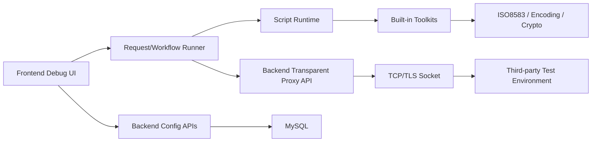

# Debug 工具技术规范草案

## 1. 背景

Faker 当前同时包含 Mock TCP、渠道配置、用户管理、MCP/API 与 Debug 调试能力。Debug 模块的目标不是只服务 POS 业务，而是成为一个通用的研发调试工具：能够调试第三方真实测试环境，验证协议参数和业务逻辑，并为后续编码、测试用例提供事实基础。

之前 Debug 后端承担了较多业务处理，包括 XML 补全、ISO8583 打包/解包、MAC/PIN 处理、TID 初始化流程编排、响应解析等。这会导致调试过程存在隐含逻辑，用户难以判断最终发出去的报文到底经过了哪些转换。

本规范将 Debug 调整为：

- 后端只提供配置、权限、持久化和透明传输能力。
- 前端负责变量解析、脚本执行、报文转换、MAC/PIN、打包/解包、Workflow 编排。
- POS ISO8583 能力通过前端内置工具函数和模板提供易用性，但不绑定 Debug 的通用模型。

## 2. 目标

1. Debug 模块支持通用 Request 和 Workflow。
2. 后端新增透明 TCP/TLS 代理能力，但不参与协议业务处理。
3. 前端提供类似 Postman 的变量、环境、集合、脚本和控制台体验。
4. POS ISO8583 作为内置工具包存在，方便用户快速完成 XML、Packager、MAC、PIN、Framing 等处理。
5. 所有变量读取、转换、脚本动作、发送和接收过程必须可见，并输出到 Console。
6. TID 初始化等多步骤业务通过 Workflow 实现，遇到错误立即停止。

## 3. 非目标

以下内容不在第一阶段实现范围内：

- 后端继续替用户完成 ISO8583 业务处理。
- 后端自动保存 TPK/TSK/TMK 等中间结果。
- 一开始就支持完整自定义脚本生态、第三方 npm 包加载。
- 一开始就支持 HTTP 类 Debug 的完整能力。
- 让浏览器直接建立 TCP/TLS 连接。浏览器无法直接做这件事，因此需要后端透明代理。

## 4. 核心原则

### 4.1 无隐含逻辑

Debug 执行过程中，所有变量来源、默认值、自动替换、报文转换、MAC/PIN 计算、打包、发送、响应解析都必须进入 Console。

例如：

```text
[vars] read target.ip from environment: 203.0.113.10
[vars] read target.port from environment: 9702
[iso] set DE11: generated STAN 483920
[mac] algorithm SHA-256 Field128, tsk source environment.dynamicKeys.tsk
[pack] XML -> ISO bytes, length 312
[transport] TLS send 314 bytes to 203.0.113.10:9702
```

### 4.2 后端透明代理

后端 Debug 传输接口只做：

- 权限校验。
- 目标地址策略校验。
- TCP/TLS socket 建立。
- 请求 bytes 透传。
- 响应 bytes 透传。
- 连接超时、读超时、异常记录。

后端不做：

- ISO8583 字段解析。
- MAC 计算或验证。
- PIN 加密。
- TID 初始化步骤判断。
- DE39、DE64、DE128 等业务字段解释。
- 自动保存 Key。

### 4.3 通用模型，POS 工具化

Debug 的基础模型是通用的：Collection、Environment、Request、Workflow、Script、Run。

POS ISO8583 是工具包，不是模型本身。POS 能力通过内置函数、模板和 UI 快捷入口提供：

- XML 生成。
- 智能替换。
- ISO8583 pack/unpack。
- MAC/PIN。
- TID 初始化 Workflow 模板。
- 参数下载 Workflow 模板。

### 4.4 用户显式确认环境变更

Workflow 可以产生运行时变量和环境变量变更建议，但不能直接静默写入环境。

例如 TID 初始化得到 TMK/TPK/TSK 后，应展示变更 diff：

```text
dynamicKeys.tmk: "" -> "..."
dynamicKeys.tpk: "" -> "..."
dynamicKeys.tsk: "" -> "..."
```

用户点击 Apply 后才写入数据库。

## 5. 总体架构



### 5.1 前端职责

- 管理 Debug 页面交互。
- 选择 Collection、Environment、Request。
- 解析变量。
- 执行 pre-script、post-script、test-script。
- 编排 Workflow。
- 执行 XML/ASCII/HEX 切换。
- 调用内置 Toolkit。
- 调用后端透明代理发送 bytes。
- 输出 Console。
- 保存 Request、Workflow、History、Environment 变更。

### 5.2 后端职责

- 用户认证和权限控制。
- Collection、Environment、Request、Workflow、History 持久化。
- MCP/API 暴露配置能力。
- 透明 TCP/TLS 代理。
- 可选的运行记录保存。
- 不参与 Debug 报文业务逻辑。

## 6. 核心对象模型

### 6.1 Collection

Collection 是一组调试请求和 Workflow 的集合，类似 Postman Collection。

建议字段：

```text
id
owner_user_id
name
description
created_at
updated_at
```

Collection 下挂：

- Request。
- Workflow。
- Environment。

### 6.2 Environment

Environment 是一套运行环境变量，例如某个渠道的 Test 环境或生产环境。

Environment 属于 Collection，不再等同于渠道配置。渠道配置是全局配置，Environment 是 Debug 使用的变量集合。

建议分区：

- 基本信息：名称、说明、所属 Collection。
- 环境配置：协议、目标 IP、端口、TLS、MAC 算法、PIN 算法。
- 环境变量：DE2、DE14、DE41、DE42、DE43、DE49、SN、其它用户自定义变量。
- 动态密钥：TMK、TPK、TSK。
- 动态参数：参数下载获得的参数。

### 6.3 Request

Request 是单次可执行请求。

建议字段：

```text
id
collection_id
name
protocol_type
url_template
request_body
request_body_type
pre_script
post_script
test_script
created_at
updated_at
```

TCP 场景下，`url_template` 示例：

```text
tcp://{{target.ip}}:{{target.port}}
```

UI 上可展示为类似 Postman 的 URL 框：

```text
TCP  {{target.ip}}:{{target.port}}  Send
```

如果识别到变量，允许点击变量 token 查看并快速填入当前环境值。

### 6.4 Workflow

Workflow 是多个步骤组成的流程，用于 TID 初始化、参数下载、业务回归等多步骤场景。

建议字段：

```text
id
collection_id
name
description
stop_on_error
created_at
updated_at
```

### 6.5 WorkflowStep

WorkflowStep 可以引用一个 Request，也可以内联定义请求内容。

建议字段：

```text
id
workflow_id
step_order
name
request_id
request_override
pre_script
post_script
test_script
continue_condition
```

执行规则：

- 默认串行执行。
- 默认 `stop_on_error = true`。
- 每个步骤可以读取前序步骤写入的 runtime variables。
- 每个步骤执行结果写入 RunStep。

### 6.6 Run 与 RunStep

Run 是一次 Request 或 Workflow 执行记录。

建议字段：

```text
debug_run
id
owner_user_id
collection_id
environment_id
target_type
target_id
status
started_at
finished_at
summary

debug_run_step
id
run_id
step_order
name
status
request_snapshot
response_snapshot
console_logs
started_at
finished_at
```

历史记录最多保留最近 30 条，可按用户和 Collection 隔离。

## 7. Request 与 Workflow 的关系

### 7.1 Request

Request 适合：

- 单笔扣款。
- 单笔余额查询。
- 单笔冲正。
- 单次参数下载。
- 单次 TCP 报文发送。
- 单次 HTTP 请求。

Request 是最小可执行单元。

### 7.2 Workflow

Workflow 适合：

- TID 初始化三步骤。
- 参数下载后自动解析并生成环境变更建议。
- 复杂业务链路。
- 回归场景。

Workflow 不应该替代 Request。Workflow 只是把多个 Request 或步骤组织起来，并管理中间变量。

### 7.3 TID 初始化安排

TID 初始化应作为内置 Workflow 模板：

1. TID-TMK：`0800 / DE3=9A0000 / 0810`
2. TID-TPK：`0800 / DE3=9G0000 / 0810`
3. TID-TSK：`0800 / DE3=9B0000 / 0810`

输入：

- TID。
- SN。
- Environment 中的 target IP、Port、TLS、Packager 等。

不需要输入 PAN/PIN。

每一步：

- 生成请求 XML。
- 执行 pre-script。
- pack。
- 通过透明代理发送。
- unpack。
- 执行 post-script。
- 写入 runtime variables。
- 输出完整 Console。

任一步失败，立即停止后续步骤。

## 8. 变量体系

变量优先级：

```text
runtime variables
request variables
workflow variables
environment variables
collection variables
global defaults
```

要求：

- 每次读取变量都记录来源。
- 敏感变量输出时脱敏，例如 TPK、TSK、TMK、PIN。
- 用户可查看变量解析结果。
- 用户可在智能替换前查看前后 diff。

变量读取示例：

```javascript
const ip = vars.get("target.ip");
const port = vars.get("target.port");
const tid = vars.get("DE41");
```

变量写入示例：

```javascript
runtime.set("tmk.cipher", response.field(62));
```

环境变更建议：

```javascript
envPatch.set("dynamicKeys.tmk", runtime.get("tmk.plain"));
```

## 9. Script 模型

每个 Request 和 WorkflowStep 支持三类脚本：

### 9.1 Pre-script

发送前执行，用于：

- 变量替换。
- 生成 STAN、RRN、时间字段。
- MAC/PIN。
- pack。
- 设置请求 bytes。

### 9.2 Post-script

收到响应后执行，用于：

- unpack。
- 转换响应 XML。
- 提取字段。
- 写入 runtime variables。
- 生成环境变更建议。

### 9.3 Test-script

断言执行结果，用于：

- 校验 DE39。
- 校验 MAC。
- 校验响应字段。
- 标记步骤成功或失败。

## 10. 内置函数与 Toolkit

### 10.1 通用函数

```javascript
vars.get(name)
vars.source(name)
runtime.get(name)
runtime.set(name, value)
envPatch.set(path, value)
console.log(message)
assert.equal(actual, expected, message)
encoding.hexToBytes(hex)
encoding.bytesToHex(bytes)
encoding.asciiToBytes(text)
encoding.bytesToAscii(bytes)
crypto.sha256(bytes)
transport.sendTcp(options)
```

### 10.2 TCP/TLS 传输函数

```javascript
const response = await transport.sendTcp({
  host: vars.get("target.ip"),
  port: Number(vars.get("target.port")),
  tls: vars.get("target.tls") === true,
  payload: request.bytes,
  connectTimeoutMs: 5000,
  readTimeoutMs: 15000
});
```

该函数调用后端透明代理。

### 10.3 POS ISO8583 Toolkit

```javascript
iso.xmlToMessage(xml)
iso.messageToXml(message)
iso.pack(message, packager)
iso.unpack(bytes, packager)
iso.applyFraming(bytes, framing)
iso.removeFraming(bytes, framing)
iso.calculateMac(message, options)
iso.verifyMac(message, options)
iso.generateStan()
iso.generateRrn()
iso.fillCurrentTimeFields(message)
iso.encryptPinBlock(options)
```

POS Toolkit 的实现位置应优先在前端 runtime/toolkit 中。后端不参与这些计算。

## 11. 透明 TCP/TLS 代理 API

### 11.1 API

```http
POST /api/debug/transports/tcp/send
```

请求：

```json
{
  "host": "203.0.113.10",
  "port": 9702,
  "tls": true,
  "payloadEncoding": "hex",
  "payload": "003C30383030...",
  "connectTimeoutMs": 5000,
  "readTimeoutMs": 15000
}
```

响应：

```json
{
  "status": "OK",
  "durationMs": 382,
  "responseEncoding": "hex",
  "response": "003E30383130...",
  "remoteAddress": "203.0.113.10:9702"
}
```

异常响应：

```json
{
  "status": "ERROR",
  "errorCode": "READ_TIMEOUT",
  "message": "Read timeout after 15000ms"
}
```

### 11.2 代理约束

- API/MCP 服务端口固定保持 `18080`。
- Mock TCP 监听端口仍只允许 `14400-14700`。
- Debug 透明代理连接第三方目标端口，不受 Mock TCP 端口范围限制。
- TLS 连接不验证外部服务证书。
- 后端不解析 payload 内容。
- 后端日志只记录连接元信息和 bytes 长度，不记录敏感明文。

## 12. Console 与日志

### 12.1 Console 位置

Console 固定在屏幕底部，中间内容区滚动，不能遮挡其它部件。

### 12.2 日志内容

必须输出：

- 变量读取：变量名、来源、值或脱敏值。
- 自动生成：STAN、RRN、时间字段。
- 字段替换：字段、旧值、新值。
- MAC/PIN：算法、输入来源、输出字段，不输出敏感原文。
- Pack/Unpack：packager、输入输出长度。
- Framing：长度头、Header/TPDU。
- Transport：host、port、tls、payload length、response length、耗时。
- Script：脚本阶段、执行结果、错误堆栈。
- Workflow：步骤开始、步骤结束、失败中止原因。

### 12.3 流式输出

第一阶段可以前端本地即时输出脚本日志，透明代理响应完成后追加传输日志。

第二阶段引入 WebSocket 或 SSE：

```text
GET /api/debug/runs/{runId}/events
```

事件类型：

```text
RUN_STARTED
STEP_STARTED
LOG
TRANSPORT_STARTED
TRANSPORT_FINISHED
STEP_FINISHED
RUN_FINISHED
ERROR
```

## 13. POS XML 生成与智能替换

### 13.1 XML 生成

根据能力自动生成 XML：

- MTI。
- Process Code。
- 响应预期 MTI。
- 环境变量。
- 动态参数。
- STAN。
- RRN。
- 时间字段。
- 手册中明确的必填字段。

取不到值的字段填空字符串：

```xml
<field id="41" value=""/>
```

### 13.2 智能替换

智能替换前必须展示 diff。可选替换范围：

- 动态参数。
- 环境变量。
- STAN。
- 时间戳。
- RRN。

示例：

```text
DE11: "000001" -> "483920"
DE41: "" -> "TERM0001"
DE37: "" -> "260603113920"
```

用户点击 Apply 后才修改请求内容。

## 14. UI 布局方向

整体学习 Postman：

- 顶部一级导航：渠道配置、Mock 工具、调试工具、系统。
- 右侧显示当前渠道和登录用户。
- 左侧为 Collection / Request / Workflow 树。
- Environment 选择靠近请求发送区。
- 内容区顶部为协议与目标地址输入框。
- 请求和响应合并为一个执行面板，支持 XML / 原始 ASCII / HEX 切换。
- 历史记录放右侧，占比约 35%，使用紧凑列表，不使用卡片。
- Console 固定底部。

## 15. MCP/API 能力

MCP 需要开放：

- Collection CRUD。
- Environment CRUD。
- Request CRUD。
- Workflow CRUD。
- 透明 TCP/TLS 代理调用。
- 脚本模板生成。
- POS XML 模板生成。

MCP 可以帮助 AI 生成请求、脚本、Workflow，但不能隐藏运行逻辑。生成结果必须落到用户可见的 Request、Workflow 或 Script 中。

## 16. 数据表规划

建议新增或调整：

```text
debug_collection
debug_environment
debug_request
debug_workflow
debug_workflow_step
debug_run
debug_run_step
debug_history
```

`debug_environment` 继续持久化到 MySQL，不再放前端 localStorage。前端最多只做缓存。

所有用户数据必须按 `owner_user_id` 隔离。

全局数据仍包括：

- 渠道配置。
- Key 配置。
- 公开规则。
- 系统用户管理。

## 17. 实施计划

### Phase 0：冻结旧 Debug 后端处理路径

- 标记旧的后端 POS Debug 业务处理 API 为 deprecated。
- 不再往旧路径叠加新能力。
- 保留兼容直到新 Debug 路径可用。

验收：

- 新需求不会继续增加后端协议处理逻辑。

### Phase 1：透明 TCP/TLS 代理

- 新增 `/api/debug/transports/tcp/send`。
- 支持 TCP/TLS、连接超时、读取超时。
- TLS 不验证外部证书。
- 返回 hex 响应。

验收：

- 前端传入 hex bytes，后端原样发送。
- 后端不解析 ISO8583。

### Phase 2：Collection / Environment / Request 持久化

- Collection 挪到 Debug 主结构。
- Environment 挂在 Collection 下。
- Request 挂在 Collection 下。
- 所有数据写入数据库。

验收：

- 刷新浏览器后数据仍存在。
- 不依赖 localStorage 保存配置。

### Phase 3：前端 Request Runner

- 变量解析。
- pre-script/post-script/test-script。
- Console。
- 调用透明代理。
- 请求历史。

验收：

- 用户可以看到完整执行日志。
- Request 能单独执行。

### Phase 4：POS Toolkit

- XML 生成。
- 智能替换。
- ISO8583 pack/unpack。
- MAC/PIN。
- XML / ASCII / HEX 切换。

验收：

- POS 报文处理全部发生在前端。
- 每一步转换都有 Console 日志。

### Phase 5：Workflow Runner

- Workflow 和 Step。
- TID 初始化模板。
- 中间变量。
- 环境变更 diff。
- 失败立即停止。

验收：

- TID 初始化三步骤可执行。
- 不自动保存 Key。
- 用户确认后才 Apply 到 Environment。

### Phase 6：流式日志

- 引入 WebSocket 或 SSE。
- 后端透明代理连接事件可实时推送。
- Workflow 步骤实时更新。

验收：

- 执行过程中 Console 持续输出，而不是结束后一次性刷新。

## 18. 验收标准

1. 新 Debug 路径中，后端不做 ISO8583、MAC、PIN、TID 初始化业务处理。
2. 所有配置数据存储在 MySQL，前端不把配置放 localStorage。
3. Request 与 Workflow 分工清晰。
4. TID 初始化通过 Workflow 模板完成。
5. 每个变量来源和转换过程都有 Console 日志。
6. 用户能在保存动态 Key 或动态参数前看到 diff。
7. POS 是内置 Toolkit，不影响 Debug 的通用性。
8. MCP/API 能创建和管理 Collection、Environment、Request、Workflow。

## 19. 待确认问题

1. 前端脚本运行环境采用 Web Worker、iframe sandbox，还是受限 JS Interpreter。
2. Java 自定义 Packager 如何给前端使用：需要导出字段 schema，还是只支持 XML Packager 的前端打包。
3. 是否允许用户写完整自定义 JS，还是只允许使用受限脚本和内置函数。
4. 透明代理是否允许用户直接填写任意 host/port，还是必须来自 Environment。
5. Debug Run 是否需要长期保存，还是仍然最多保存最近 30 条历史。
